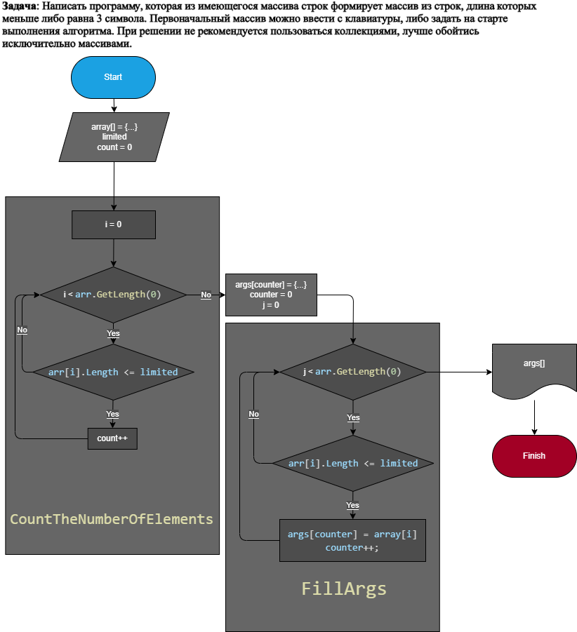

# GeekBrainsControlWorkMod1

## Выполнение

### Блок-схема

Для выполнения работы, перед написание программы, создадим блок-схему:

### Идея

Введённый в начале массив *array* и есть изначальный, узнав количество в нём нужных нам элементов (при помощи метода *CountTheNumberOfElements*), создаём новый массив *args*. Далее опять проходим по *array* и записываем нужные элементы в *args* (при помощи метода *FillArgs*). Печатаем ответ.

### Программа

Пишем программу на C#.

*код:*

    namespace ControlWork
    {
        class Program
        {
            public static void Main()
            {
                int limited = 3;
                string[] array = new string[] {"hello", "world", "hi", "wor", "wo"};

                string[] args = new string[CountTheNumberOfElements(array, limited)];

                FillArgs(args, array, limited);

                Console.WriteLine("[{0}]", string.Join(", ", args));
            }
            public static int CountTheNumberOfElements(string[] arr, int lim)
            {
                int count = 0;
                for (int i = 0; i < arr.GetLength(0); i++)
                {
                    if (arr[i].Length <= lim) count++;
                }
                return count;
            }
            public static void FillArgs(string[] args, string[] array, int lim)
            {
                int counter = 0;
                for (int i = 0; i < array.GetLength(0); i++)
                {
                    if (array[i].Length <= lim)
                    {
                        args[counter] = array[i];
                        counter++;
                    }
                }
            }
        }
    }
